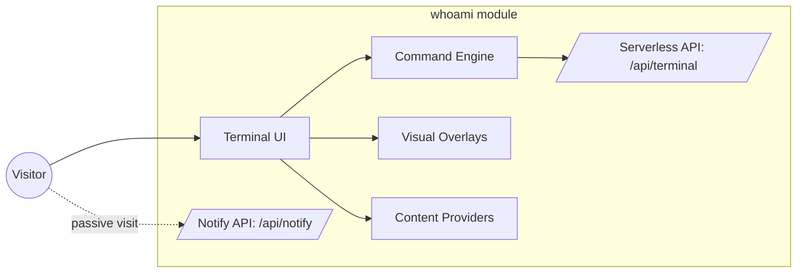
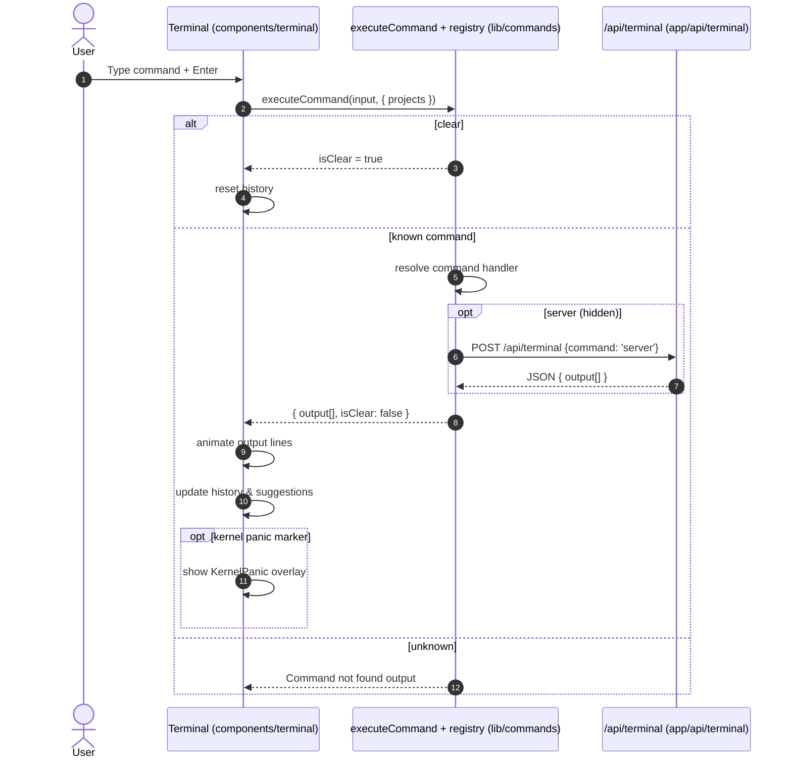
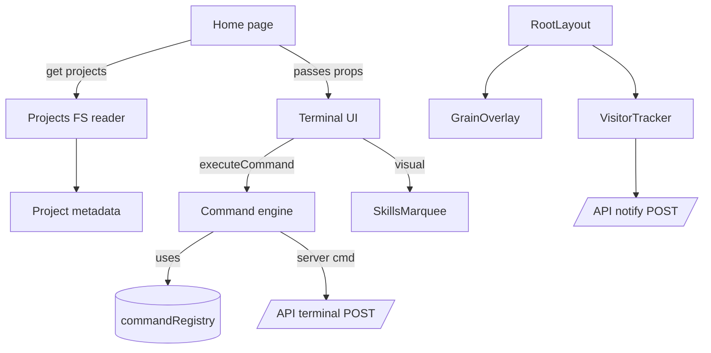

whoami module

Purpose
- Provide an immersive, keyboard-driven terminal experience on the homepage that auto-runs the whoami command and exposes a small command palette for portfolio exploration.
- Bridge client UI, a lightweight command engine, and serverless API routes to fetch runtime data.
- Showcase visual skills and playful easter-eggs while remaining accessible and performant.

Scope and boundaries
- In scope: Terminal UI, command engine and registry, serverless terminal API, skills visualizer, kernel panic flow marker, projects content integration, and basic visit notifications.
- Out of scope: Site-wide navigation, blog rendering pipeline, and generic layout/theming primitives. Refer to their dedicated docs if present in the repo, e.g. [navigation.md], [blog.md], [layout.md].

Architecture overview

Runtime data flow (terminal command lifecycle)

Key design decisions
- Split responsibilities clearly: UI (Terminal) is stateless regarding command semantics; commands encapsulate logic and formatting, and APIs encapsulate privileged or environment-bound actions.
- Commands are registered in-process via a Map, enabling autocomplete and help generation directly from the registry.
- Visual features (skills overlay, kernel panic) are decoupled and triggered by command output markers, keeping UI/logic boundaries clean.
- Server command is asynchronous and resilient; on failure it returns helpful diagnostic lines without breaking the terminal.

Sub-modules overview
The whoami module is organized into the following sub-modules. Detailed docs are generated per sub-module and linked here.

- whoami_terminal_ui: [whoami_terminal_ui.md]
- whoami_commands_engine: [whoami_commands_engine.md]
- whoami_serverless_api: [whoami_serverless_api.md]
- whoami_home_integration: [whoami_home_integration.md]
- whoami_visitor_notify: [whoami_visitor_notify.md]

How this module fits into the overall system
- The module powers the homepage hero via <Terminal />, fed with project metadata from lib/projects (filesystem) with a static fallback in lib/data/projects.
- It minimally depends on layout/theming and navigation shells, and coexists with the blog feature. See [layout.md] and [blog.md] when available.

Notable cross-module references
- app/page.tsx::Home wires projects into Terminal.
- components/theme-provider.tsx::ThemeProvider and app/layout.tsx::RootLayout apply cross-cutting theming and overlays (e.g., GrainOverlay).
- components/visitor-tracker.tsx::VisitorTracker and app/api/notify/route.ts::POST provide optional visit notifications, independent from terminal functionality.

Operations and observability
- The serverless terminal endpoint exposes instance uptime and memory in a human-readable format for quick checks during demos.
- VisitorTracker posts a minimal payload to /api/notify (Nodemailer + Gmail SMTP). Ensure SMTP_USER/SMTP_PASS are configured in environment variables.
- Client-side work is optimized via minimal setTimeouts and animation timers; long operations are guarded with AbortController timeouts.

Security and privacy
- /api/terminal exposes non-sensitive process/host metadata typical of serverless demos; avoid expanding this route to expose credentials or secrets.
- /api/notify requires SMTP credentials; do not commit these values. Consider rate limiting or CAPTCHA if enabling in production.

Appendix: component dependency map

