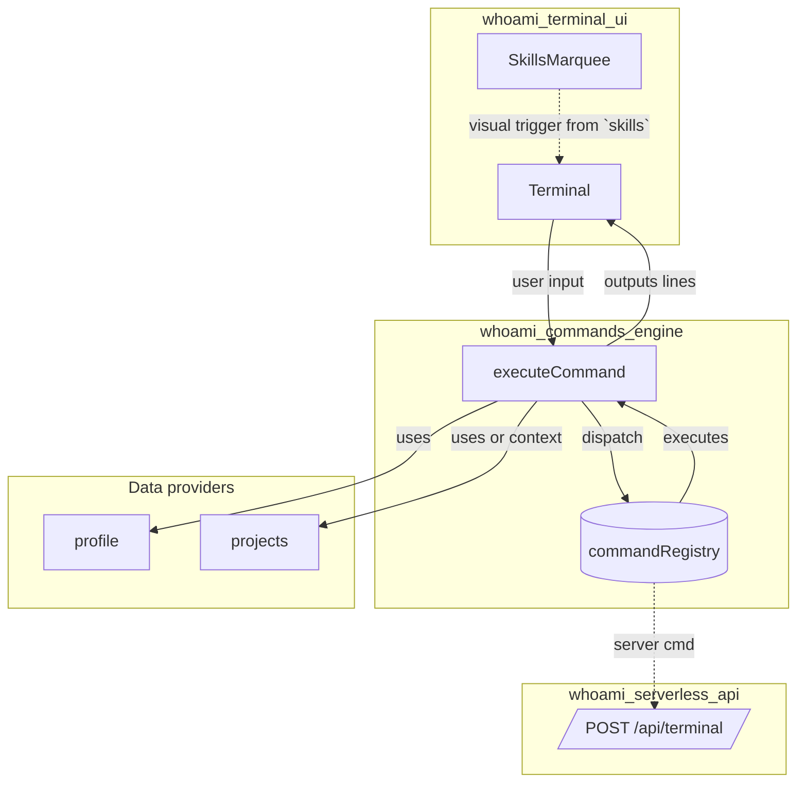
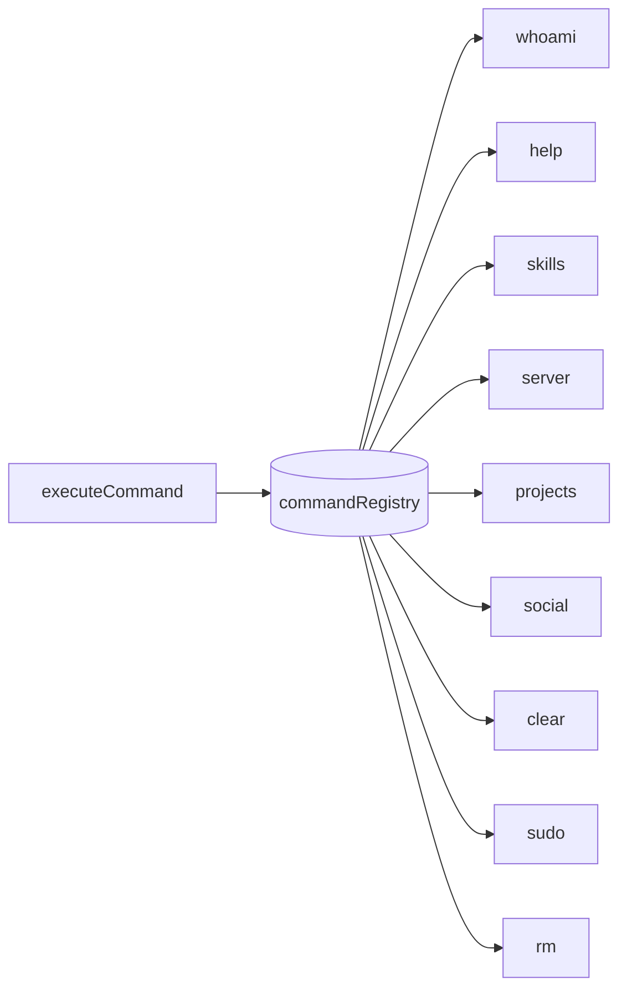
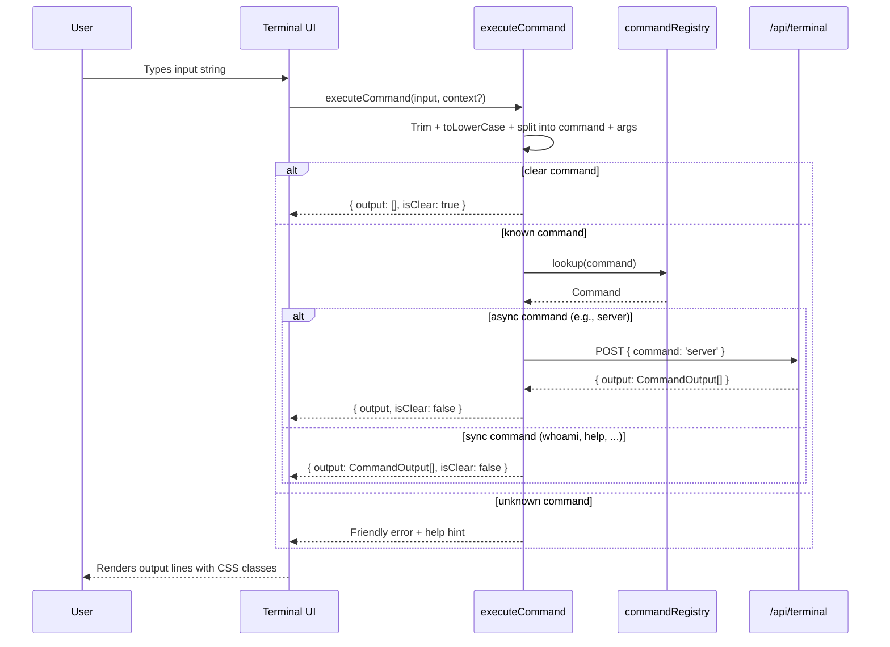
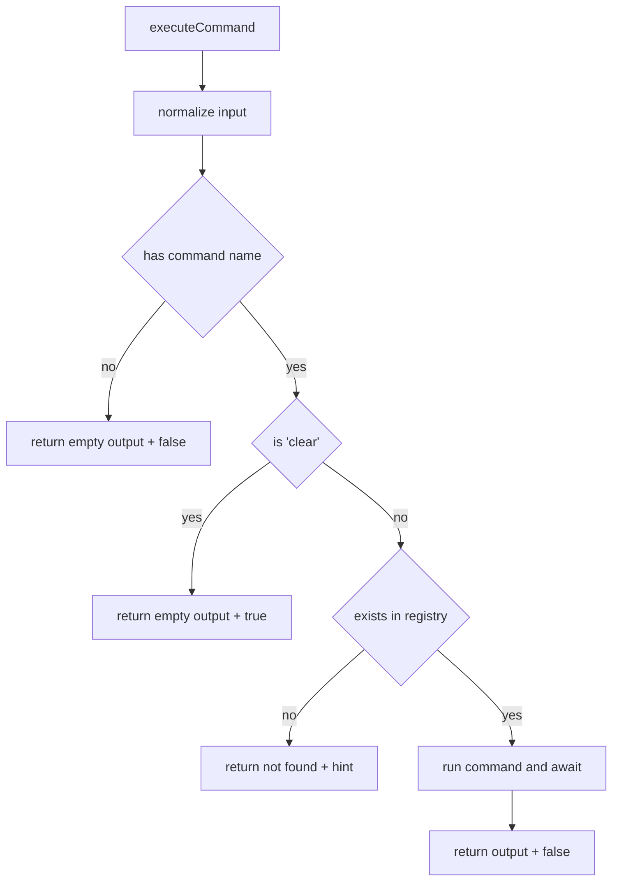

# whoami_commands_engine

Brief introduction
The whoami_commands_engine module provides the command execution core that powers the in-browser terminal experience. It exposes a small command runtime with a registry, a uniform Command interface, and a single entrypoint executeCommand that parses user input, dispatches to registered commands (sync or async), and returns structured CommandOutput lines for the UI to render.

This engine integrates with:
- whoami_terminal_ui for input, rendering, effects, and keyboard features. See [whoami_terminal_ui].md
- whoami_serverless_api for the server command that queries runtime information. See [whoami_serverless_api].md
- whoami_home_integration as the canonical source for project metadata used by the projects command. See [whoami_home_integration].md


Comprehensive documentation
1) Responsibilities and core concepts
- CommandOutput: UI contract for a single rendered line
  - text: string content
  - className?: CSS utility classes that the Terminal consumes directly
- CommandContext: optional per-invocation context bag
  - projects?: any[] (override the default projects list at runtime)
  - [key: string]: any (future extensibility)
- Command: runtime unit registered in the commandRegistry
  - name, description, optional usage, optional hidden
  - execute(args?: string[], context?: CommandContext): Promise/array of CommandOutput
- commandRegistry: Map<string, Command> that holds all registered commands
- executeCommand(input, context?): public API that parses, routes, and returns { output: CommandOutput[]; isClear: boolean }

Registered commands in this module
- whoami: prints a minimal profile banner and interests
- help: enumerates non-hidden commands with descriptions
- skills: instructs the UI to launch a visual skills sequence
- server (hidden): calls POST /api/terminal via whoami_serverless_api and renders the returned lines; times out after 8s
- projects: lists featured projects from context.projects or the local projects import
- social: prints social links from profile
- clear: special-case to clear terminal (returns no lines with isClear = true)
- sudo (hidden): easter egg; returns a special marker line "__KERNEL_PANIC__" that the UI may detect for effects
- rm (hidden): easter egg; playful error messaging


2) How the module fits into the overall system
The engine acts as the command-processing boundary between the UI and data/services. It receives canonical user input from the Terminal, decides which command executes, optionally calls serverless APIs, and returns UI-ready lines. It is therefore UI-agnostic but UI-aware through styling contracts (className) and special markers.

See also:
- UI details, keyboard handling, history, autocomplete: [whoami_terminal_ui].md
- API surface for /api/terminal and its response format: [whoami_serverless_api].md
- Project metadata sourcing and utilities: [whoami_home_integration].md


3) High-level architecture (modules and integrations)


Notes
- The server command fetches API output via whoami_serverless_api and converts it into CommandOutput[] lines for the Terminal.
- The projects command can consume runtime-provided projects via CommandContext or fallback to the default projects import. The canonical project metadata lives in whoami_home_integration; prefer injecting data from [whoami_home_integration].md to keep concerns separated.


4) Internal component relationships (within the engine)



5) Data flow (end-to-end)



6) Command lifecycle and execution rules
- Input normalization: input is trimmed and lowercased. Command names must be registered in lowercase to match routing. Arguments are split on whitespace.
- Clear behavior: clear short-circuits routing and returns isClear = true so the UI can reset the viewport.
- Unknown command: returns a styled error and a hint to type help.
- Sync vs async: execute may return an array or a Promise of an array; executeCommand awaits it in both cases.
- Styling contract: CommandOutput.className contains UI classes (e.g., Tailwind utilities) that the Terminal applies directly when rendering.
- Special markers: sudo may emit a hidden line with text "__KERNEL_PANIC__". The Terminal can interpret this as a control signal for special effects. See [whoami_terminal_ui].md


7) Command-specific notes
- whoami
  - Prints a minimal banner, title, and interests.
  - Ends with a usage hint to type help.
- help
  - Lists all commands that are not hidden. Uses commandRegistry.forEach and pads names for aligned display.
- skills
  - Prints system messages that the UI can use to activate SkillsMarquee or a background visualizer. See [whoami_terminal_ui].md
- server (hidden)
  - Uses AbortController with an 8s timeout to POST /api/terminal and expects { output: CommandOutput[] } from the serverless function. On failure, renders a friendly error.
  - Endpoint details and sample response format are documented in [whoami_serverless_api].md
- projects
  - Resolves its data source with (context?.projects || projects).
  - For maintainability, prefer injecting the canonical list from [whoami_home_integration].md (e.g., getProjects) via CommandContext when invoking executeCommand from the UI/page layer.
  - Renders title, description, optional techStack, and an external link.
- social
  - Iterates profile.social and prints platform → URL entries.
- clear
  - Handled specially in executeCommand to return isClear = true; the command object also exists to document intent but returns an empty array when invoked directly.
- sudo/rm (hidden)
  - Easter eggs; do not show in help.


8) Extending the command set
Steps to add a new command
- Create a Command object and register it via commandRegistry.set("<name>", command)
- Keep the name lowercase and concise; provide description and optional usage
- Implement execute(args, context) returning CommandOutput[] (or a Promise thereof)
- If the command should not be shown in help, set hidden: true
- If you need data, consume it from context (preferred) or import a module

Example
```ts
commandRegistry.set("echo", {
  name: "echo",
  description: "Echo back arguments",
  usage: "echo <text>",
  execute: (args) => [{ text: `  ${args?.join(" ") ?? ""}`, className: "text-zinc-300" }],
})
```

Wiring from the UI
- The Terminal should pass CommandContext when calling executeCommand. For example, inject projects from [whoami_home_integration].md:
```ts
const { output, isClear } = await executeCommand(input, { projects: getProjects() })
```


9) Error handling and timeouts
- Unknown command: standardized error + help hint
- Server command: AbortController enforces an 8s timeout; failure renders a clear red banner plus guidance
- Defensive rendering: Commands often include empty spacer lines to keep layout stable in the UI


10) Contracts and response shapes
- executeCommand returns
  - output: CommandOutput[] (possibly empty)
  - isClear: boolean (true only for the clear command path)
- Serverless API expectation (server command)
  - Response JSON contains an output field: CommandOutput[]
  - See [whoami_serverless_api].md for the authoritative schema


11) Dependencies and cross-module references
- UI: [whoami_terminal_ui].md (Terminal, SkillsMarquee, GrainOverlay)
- API: [whoami_serverless_api].md (POST /api/terminal)
- Home integration and data: [whoami_home_integration].md (ProjectMetadata, getProjects, Project)
- Visitor notifications (not directly used here): [whoami_visitor_notify].md


12) Process flow: executeCommand decision tree



13) Testing guidance
- Unit test executeCommand parsing for: empty input, clear, unknown, known with args, case-insensitivity
- Stub async fetch for the server command and test success + abort/timeout paths
- Snapshot-test CommandOutput arrays for stable UI rendering (text + className)
- Inject context.projects to verify projects command uses overrides when provided


14) Maintenance notes
- Keep command implementations small and side-effect free; prefer delegating heavy-lifting to API or data modules
- Avoid tight-coupling to specific CSS frameworks in command code; use semantic class groupings when possible
- For new data dependencies, prefer passing via CommandContext rather than importing, to decouple engine from data sourcing
- Keep hidden commands hidden by setting hidden: true and avoid exposing them in help


15) Security and performance
- The server command validates network health via timeout; consider exponential backoff only if future requirements demand retries
- Avoid rendering untrusted HTML; all output is plain text + className; links are printed as text that the UI can render as anchors if desired
- Ensure that any future command that executes remote calls sanitizes inputs and follows CORS and CSRF constraints defined in [whoami_serverless_api].md


Appendix: Types (from lib/commands.ts)
```ts
export interface CommandOutput {
  text: string
  className?: string
}

export interface CommandContext {
  projects?: any[]
  [key: string]: any
}

export interface Command {
  name: string
  description: string
  usage?: string
  hidden?: boolean
  execute: (args?: string[], context?: CommandContext) => CommandOutput[] | Promise<CommandOutput[]>
}

export async function executeCommand(input: string, context?: CommandContext): Promise<{ output: CommandOutput[]; isClear: boolean }>
```