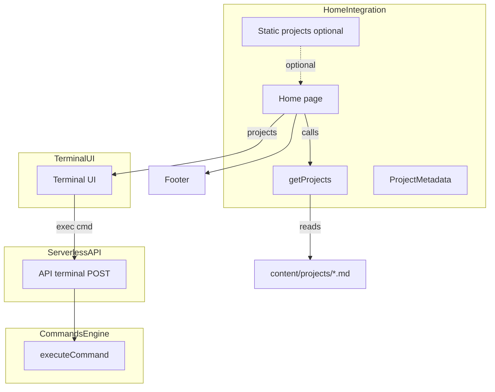
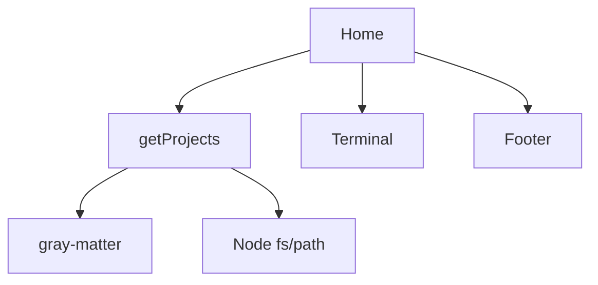
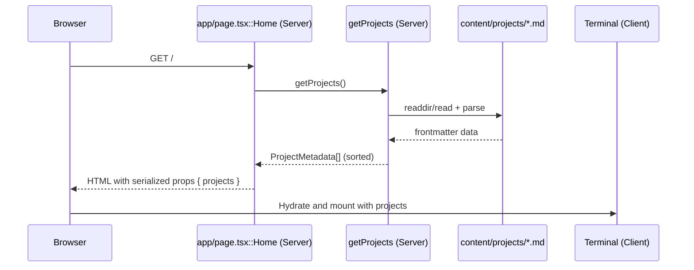
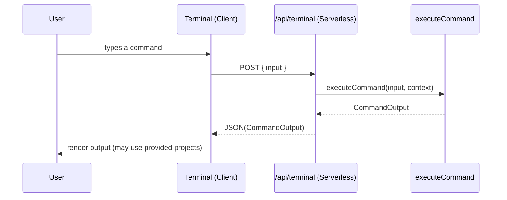

# whoami_home_integration

Brief introduction
The whoami_home_integration module owns the Home page and the content-to-UI wiring for the portfolio. It server-renders project metadata from Markdown, passes it to the interactive Terminal UI, and composes the page shell (e.g., Footer). It forms the bridge between content storage, the terminal-driven experience, and other modules such as the serverless command API.

Core responsibilities
- Render the Home page (app/page.tsx::Home) as a server component
- Load, normalize, and sort project metadata from content/projects (lib/projects.ts)
- Provide the Terminal UI with project data to enable project-centric commands and views
- Optionally fall back to a small, static in-repo dataset (lib/data/projects.ts)

Links to related module docs
- Terminal UI and presentation: [whoami_terminal_ui.md]
- Commands execution model: [whoami_commands_engine.md]
- Serverless command API: [whoami_serverless_api.md]
- Visitor notification/analytics: [whoami_visitor_notify.md]


1) Architecture overview



Key points
- app/page.tsx::Home is a server component; it can read from the filesystem and synchronously pass data to client components.
- getProjects parses Markdown frontmatter using gray-matter, returning a typed ProjectMetadata[].
- Terminal receives the projects prop and handles interactive commands, delegating execution to the serverless API.


2) Module components and contracts

2.1 app/page.tsx::Home
- Purpose: Compose the hero section, the Terminal section, and the page Footer; provide projects data to Terminal.
- Props/state: none; executes at request/build time on the server.
- External deps: Terminal (from whoami_terminal_ui), Footer (shared UI), getProjects (local server-side data adapter).
- Contract to Terminal: projects: ProjectMetadata[]

2.2 lib/projects.ts
- ProjectMetadata interface
  - title: string
  - description: string
  - year: string (used for descending sort)
  - techStack: string[]
  - link?: string
  - github?: string
  - image?: string
  - category?: string
  - slug: string (derived from filename without .md)
- getProjects(): ProjectMetadata[]
  - Reads content/projects/*.md
  - Parses gray-matter frontmatter into ProjectMetadata
  - Returns items sorted by year descending
  - If the directory does not exist, returns []

2.3 lib/data/projects.ts (optional/static dataset)
- Project interface: { title, techStack, description, link }
- Exported projects: Project[] — a small static list, useful for demo/fallbacks or tests
- Note: Shape differs from ProjectMetadata; mapping may be needed if used in the Terminal UI


3) Data model and content conventions

3.1 Frontmatter schema for content/projects/*.md
- Required: title, description, year, techStack (array), slug is inferred from filename
- Optional: link, github, image, category

Example frontmatter
```md
---
title: "AI Resume Builder"
description: "Build ATS-friendly resumes in minutes using AI."
year: "2024"
techStack: ["React", "Node.js", "OpenAI API", "MongoDB"]
link: "https://github.com/0xZKc0de/ai-resume-builder"
github: "https://github.com/0xZKc0de/ai-resume-builder"
image: "/images/projects/ai-resume.png"
category: "webapp"
---

Long-form markdown content (optional) can follow; only frontmatter is consumed by this module.
```

3.2 Mapping static Project -> ProjectMetadata (if needed)
- title -> title
- description -> description
- techStack -> techStack
- link -> link
- year -> derive or default (e.g., "0000")
- slug -> create from title or external mapping


4) Dependency and component interaction diagrams

4.1 Static dependencies


4.2 Request-time data flow (SSR boundary)


4.3 Interactive command execution (cross-module)
For execution details see [whoami_terminal_ui.md], [whoami_serverless_api.md], and [whoami_commands_engine.md].



5) How this module fits into the overall system
- Entry point of the site: Provides the landing experience and mounts the terminal.
- Data bridge: Translates filesystem content (Markdown frontmatter) into structured props for the Terminal.
- Coordination: Orchestrates UI composition without owning command logic or terminal internals; those live in [whoami_terminal_ui.md] and [whoami_commands_engine.md].
- Serverless integration: The Terminal component interacts with [whoami_serverless_api.md] for command execution; Home ensures required data props are ready on first render.
- Analytics/notifications: If the site includes visitor tracking (see [whoami_visitor_notify.md]), it is typically mounted at the app root/layout; Home has no direct dependency but coexists.


6) Operational notes and edge cases
- Missing content directory: getProjects() returns []; Terminal should gracefully handle no projects.
- Sorting: year is a string. Current sort is lexicographic; for non-4-digit or mixed formats, consider normalizing to numbers.
- Serialization: Ensure added fields in ProjectMetadata remain serializable across the server/client boundary.
- Images: image should be a public path or processed by the image pipeline; metadata only is passed by Home.
- Slugs: Derived from filename; keep filenames URL-safe.


7) Extending the module
- Add new frontmatter field
  1. Populate in content/projects/*.md
  2. The field will be included automatically via gray-matter spread, but consider updating the ProjectMetadata type
  3. Update Terminal UI rendering if it should be displayed (see [whoami_terminal_ui.md])

- Provide a fallback dataset when content/ is unavailable
  1. Import { projects as staticProjects } from lib/data/projects
  2. Map to ProjectMetadata shape (see 3.2)
  3. Pass to Terminal when getProjects() returns []

- Alter sort order
  - Modify the comparator in getProjects(); e.g., by numeric year or multi-key sort by year then title.

- Add categories/filters
  - Use the optional category field, or extend ProjectMetadata
  - Implement filter commands or UI affordances inside Terminal (see [whoami_terminal_ui.md])


8) Quick reference
- Server component: app/page.tsx::Home
- Data loader: lib/projects.ts::getProjects
- Data model: lib/projects.ts::ProjectMetadata
- Optional static data: lib/data/projects.ts::Project[]
- Upstream UI: [whoami_terminal_ui.md]
- Execution backend: [whoami_serverless_api.md], [whoami_commands_engine.md]


Appendix: File snippets for orientation

Home (excerpt)
```ts
import { Terminal } from "@/components/terminal"
import { Footer } from "@/components/footer"
import { getProjects } from "@/lib/projects"

export default function Home() {
  const projects = getProjects()
  return (
    <main>
      <section id="about">
        <Terminal projects={projects} />
      </section>
    </main>
    <Footer />
  )
}
```

getProjects (core)
```ts
export function getProjects(): ProjectMetadata[] {
  if (!fs.existsSync(projectsDirectory)) return []
  const fileNames = fs.readdirSync(projectsDirectory)
  const allProjectsData = fileNames.map((fileName) => {
    const slug = fileName.replace(/\.md$/, "")
    const fullPath = path.join(projectsDirectory, fileName)
    const fileContents = fs.readFileSync(fullPath, "utf8")
    const { data } = matter(fileContents)
    return { slug, ...(data as any) } as ProjectMetadata
  })
  return allProjectsData.sort((a, b) => (a.year < b.year ? 1 : -1))
}
```
