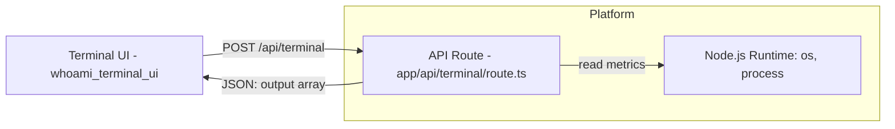
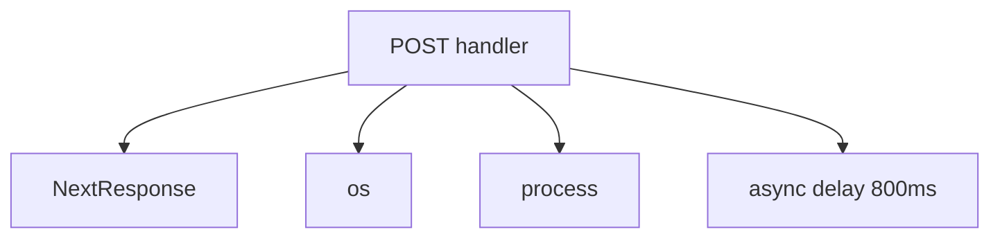
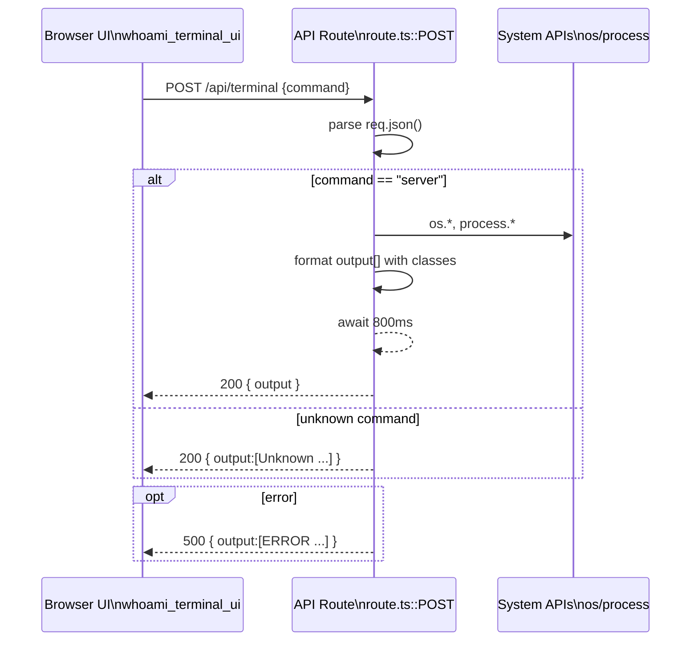
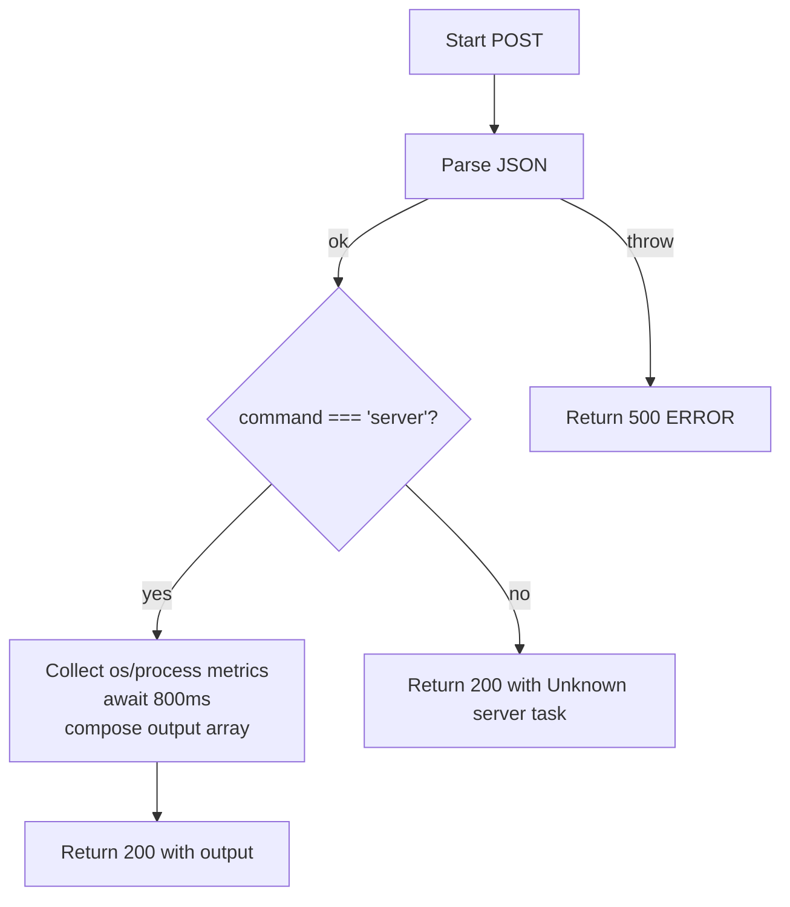

# whoami_serverless_api

Brief introduction
The whoami_serverless_api module exposes a minimal, secure serverless endpoint that powers the in-browser terminal experience. It accepts a small set of terminal-like commands and returns formatted output lines for rendering in the UI. Currently, it supports a single "server" command that surfaces runtime and system metrics from the Vercel Serverless Function environment.

References to related modules
- UI consumer: [whoami_terminal_ui.md]
- Command routing (potential future integration): [whoami_commands_engine.md]
- App shell and page wiring: [whoami_home_integration.md]
- Parallel API patterns (notify): [whoami_visitor_notify.md]


Comprehensive documentation
1) Module purpose and scope
- Purpose: Provide a typed, predictable API that the terminal UI can call to retrieve structured output lines. The output includes CSS class hints so the UI can render styled terminal lines without extra mapping.
- Scope: Implements the POST /api/terminal handler. It does not execute arbitrary shell commands, does not manage sessions, and does not perform authentication.
- Non-goals: General-purpose command execution, job orchestration, and persistent telemetry.

2) Public API contract
- Route: POST /api/terminal
- Request headers: Content-Type: application/json
- Request body schema:
  {
    "command": "server" | string
  }
- Responses:
  - 200 OK (recognized command: "server")
    {
      "output": [
        { "text": string, "className": string },
        ...
      ]
    }
  - 200 OK (unrecognized command)
    {
      "output": [
        { "text": "  Unknown server task: <value>", "className": "text-red-500" }
      ]
    }
  - 500 Internal Server Error
    {
      "output": [
        { "text": "  [ERROR] Internal server error processing API Route.", "className": "text-red-500" }
      ]
    }

- Example request (curl):
  curl -s -X POST \
    -H "Content-Type: application/json" \
    -d '{"command":"server"}' \
    /api/terminal

- Example success payload (truncated):
  {
    "output": [
      { "text": "  [ESTABLISHED] Secure connection to backend sandbox", "className": "text-emerald-500/90 font-bold mb-3 font-mono" },
      { "text": "  SYSTEM SPECIFICATIONS", "className": "text-zinc-500 tracking-widest text-[10px] uppercase mb-1 font-mono font-bold" },
      { "text": "  OS/Platform : linux (6.2.0)", "className": "text-zinc-300 font-mono" },
      ...
    ]
  }

3) Architecture overview
- Runtime: Next.js App Router API Route (app/api/terminal/route.ts) deployed as a Vercel Serverless Function.
- Key dependencies: next/server (NextResponse), Node.js os and process APIs.
- Consumer: Terminal component in [whoami_terminal_ui.md] invokes POST /api/terminal and streams the returned lines into the terminal view.

Mermaid diagram — high-level architecture


4) Component and dependency map
- Single exported handler: POST(req: Request)
- Uses:
  - NextResponse.json(...) for HTTP responses
  - os.cpus(), os.platform(), os.release(), os.arch() for environment details
  - process.memoryUsage(), process.uptime(), process.version for runtime metrics
  - setTimeout via Promise for a brief artificial delay (800ms) to align with UI loading feedback

Mermaid diagram — internal dependency graph


5) Data flow and interactions
- Request path:
  1. UI issues POST /api/terminal with { command } JSON.
  2. Handler parses req.json().
  3. If command === "server":
     - Gather metrics from process and os.
     - Synthesize output[] lines with associated CSS classes.
     - Await ~800ms to demonstrate async loader.
     - Return 200 with JSON body { output }.
  4. Else: return 200 with an "Unknown server task" line.
  5. Any thrown error returns 500 with a generic error line.

Mermaid sequence — end-to-end interaction


6) Detailed process logic

Mermaid flowchart — command handling


7) Integration within the overall system
- whoami_terminal_ui: The Terminal component triggers this endpoint upon user commands and renders the returned lines. See [whoami_terminal_ui.md] for UI rendering details and command entry UX.
- whoami_commands_engine: Consider delegating command parsing and execution to executeCommand for scalability and single-source-of-truth of command behaviors. Response adaptation may be needed to preserve the output[] format with text + className. See [whoami_commands_engine.md].
- whoami_home_integration: The Home page may embed or link to the Terminal UI. See [whoami_home_integration.md] for composition and routing.
- whoami_visitor_notify: Provides a separate /api/notify route and can serve as a reference for API patterns in this repo. See [whoami_visitor_notify.md].

8) Operational characteristics
- Environment: Designed for Vercel Serverless Functions (Node.js). Metrics reflect per-invocation state; uptime resets per cold start or new instance.
- Performance: O(1) execution with a deliberate ~800ms delay to demonstrate async loading in the UI. Remove or gate this delay for production responsiveness.
- Concurrency: Stateless; safe for concurrent invocations.
- Security & safety:
  - No shell execution, minimizing risk from arbitrary input.
  - Input is only read as a simple string; current implementation trusts the request body structure.
  - Recommended hardening: validate schema, limit accepted commands, introduce basic rate limiting or middleware.
- Observability: No logging or tracing included. Consider adding structured logs and request IDs if needed.

9) Error handling and edge cases
- Invalid/missing JSON: req.json() may throw → 500 with a generic error line.
- Unknown command: Returns 200 with a user-friendly line (text-red-500) instead of 4xx, to keep terminal UX smooth.
- Empty command: Treated as unknown.

10) Extensibility guidelines
- Adding commands: Introduce a command switch or a command map. Keep outputs as an ordered array of { text, className } objects for UI stability.
- Centralizing logic: Migrate command dispatch to [whoami_commands_engine.md] executeCommand and map the engine’s CommandOutput to the terminal output[] structure here.
- Formatting: Prefer composing display concerns (className) at the API layer to keep the Terminal component dumb/simple.
- Backward compatibility: If changing the output schema, version the endpoint or expose a format parameter.

11) Testing
- Minimal integration test (pseudo-code):
  const req = new Request("http://localhost/api/terminal", {
    method: "POST",
    headers: { "Content-Type": "application/json" },
    body: JSON.stringify({ command: "server" })
  })
  const res = await POST(req)
  const json = await res.json()
  expect(Array.isArray(json.output)).toBe(true)
  expect(json.output.some(l => /SYSTEM SPECIFICATIONS/.test(l.text))).toBe(true)

- Unknown-command case: send {command: "nope"} and assert the single red line.
- Error path: send malformed JSON; expect 500 and the ERROR line.

12) Source reference
Core implementation: app/api/terminal/route.ts::POST

```ts
import { NextResponse } from 'next/server'
import os from 'os'

export async function POST(req: Request) {
  try {
    const { command } = await req.json()

    if (command === 'server') {
      const memoryUsage = process.memoryUsage()
      const rssMB = (memoryUsage.rss / 1024 / 1024).toFixed(2)
      const heapMB = (memoryUsage.heapUsed / 1024 / 1024).toFixed(2)

      const uptimeSecs = process.uptime()
      const uptimeStr = `${Math.floor(uptimeSecs / 3600)}h ${Math.floor((uptimeSecs % 3600) / 60)}m`
      const cpus = os.cpus()
      const cpuModel = cpus.length > 0 ? cpus[0].model : 'Unknown Architecture'

      await new Promise(resolve => setTimeout(resolve, 800))

      return NextResponse.json({ output: [ /* formatted lines */ ] })
    }

    return NextResponse.json({ output: [{ text: `  Unknown server task: ${command}`, className: 'text-red-500' }] })

  } catch (error) {
    return NextResponse.json(
      { output: [{ text: '  [ERROR] Internal server error processing API Route.', className: 'text-red-500' }] },
      { status: 500 }
    )
  }
}
```

13) Change log and TODOs
- Current: Single-command implementation with formatted output and simulated delay.
- TODO:
  - Input validation and schema enforcement.
  - Optional removal/tuning of artificial delay.
  - Integrate with [whoami_commands_engine.md] for expanded command set.
  - Add telemetry and structured logging.
