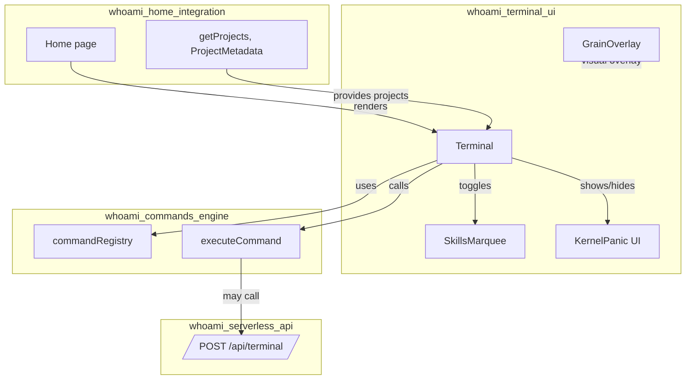
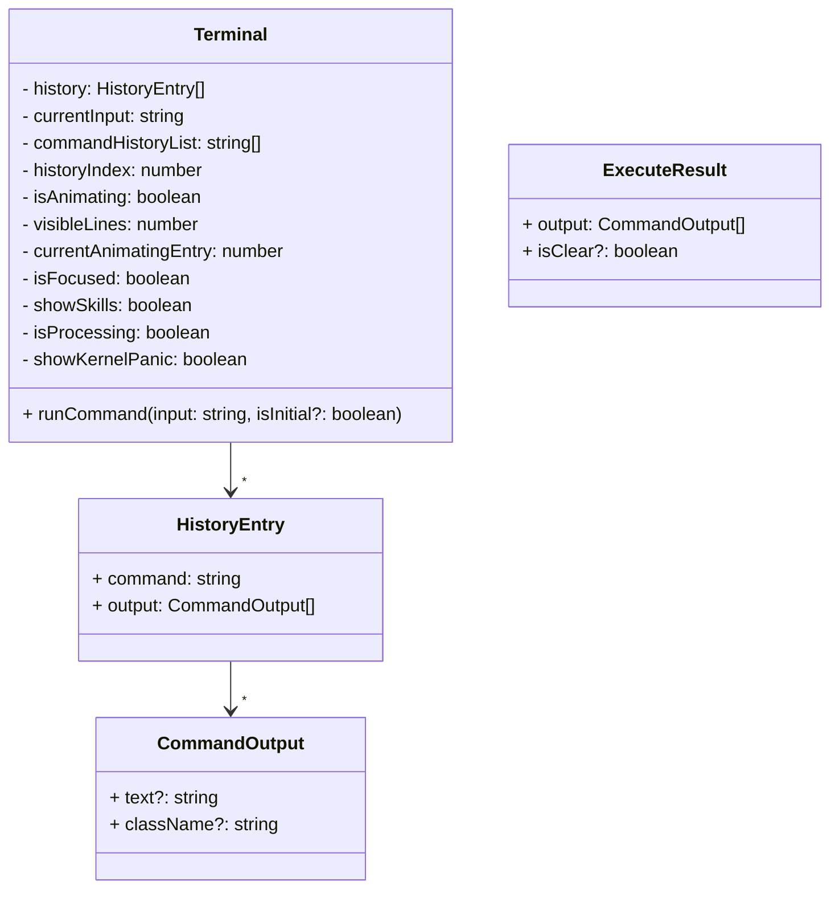
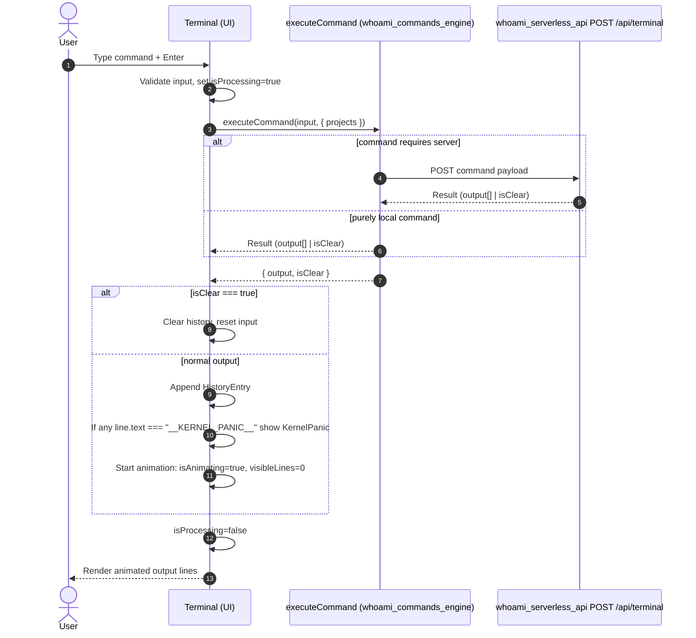
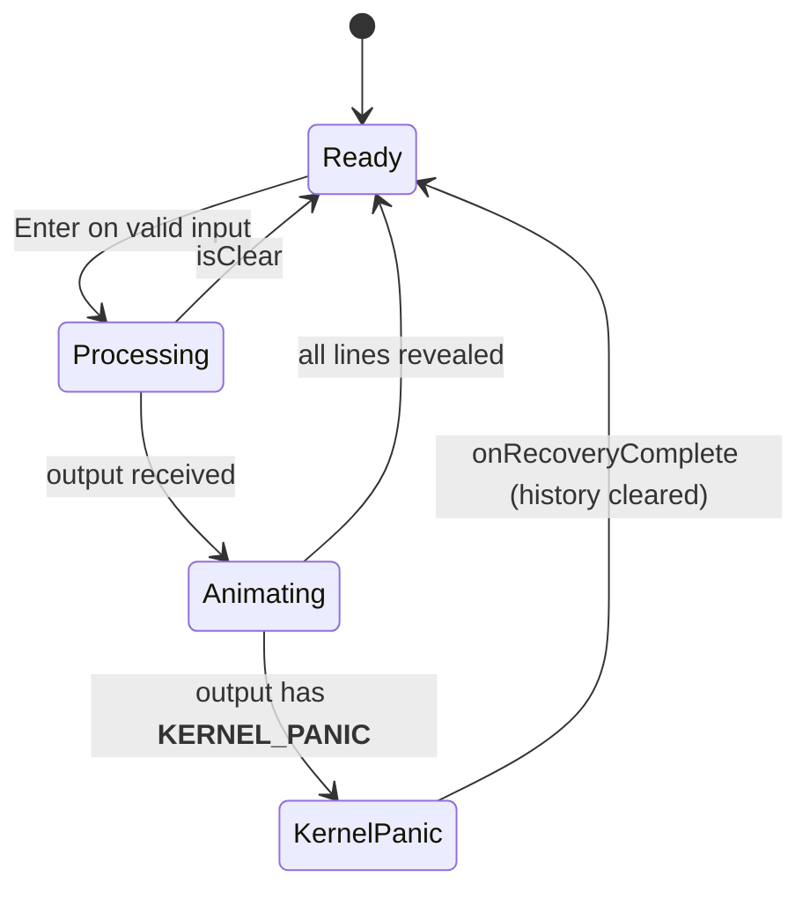
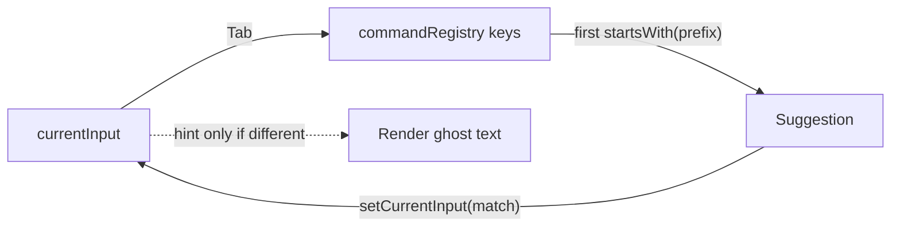

whoami_terminal_ui module documentation

Introduction
The whoami_terminal_ui module implements the interactive terminal experience on the portfolio site. It is a Next.js client-side UI that captures user input, dispatches commands to the command engine, animates outputs, and augments the experience with a dynamic skills marquee and visual grain overlay. It integrates with:
- whoami_commands_engine for command registration, tab-completion, and execution
- whoami_serverless_api for server-executed commands (via the command engine)
- whoami_home_integration to receive project data used by commands
- Optional notification/telemetry (whoami_visitor_notify) outside of this module

Core responsibilities
- Render a terminal-like UI that auto-executes whoami on mount
- Manage input state, command history, tab-completion, and focus
- Dispatch commands to the command engine and display results with line-by-line animation
- Toggle ambient UI effects (skills marquee, grain overlay) from commands
- Handle recovery scenarios (kernel panic sentinel) and clearing state

Key components
- Terminal (components/terminal.tsx)
  - Accepts projects?: any[] (typically Project[]/ProjectMetadata[] from whoami_home_integration)
  - Imports executeCommand and commandRegistry from whoami_commands_engine
  - Manages UI states: history, currentInput, commandHistoryList, historyIndex, isAnimating, isProcessing, isFocused, showSkills, showKernelPanic, visibleLines, currentAnimatingEntry
  - Keyboard features: Enter to run, ArrowUp/ArrowDown navigate command history, Tab completion using commandRegistry keys
  - Animation: reveals command output lines at 20ms intervals per line
  - Special behaviors:
    - Auto-runs whoami (after 600ms) when mounted
    - skills toggles SkillsMarquee visibility; clear hides it
    - If executeCommand returns isClear, terminal history is reset
    - If any output line has text === "__KERNEL_PANIC__", KernelPanic overlay is shown; on recovery, history is cleared

- SkillsMarquee (components/skills-marquee.tsx)
  - A background marquee of technology logos (web, devops, AI) rendered as three rows scrolling in opposite directions
  - Controlled by isVisible prop; mounted client-side for smooth transitions
  - Non-interactive; pointer-events disabled; blends with background via gradients

- GrainOverlay (components/grain-overlay.tsx)
  - Fixed-position SVG fractal noise overlay for subtle film grain across the entire viewport
  - Visual-only; no state or interactivity

- KernelPanic (external UI dependency)
  - Not defined here but imported by Terminal; displayed when the command output includes a sentinel line "__KERNEL_PANIC__"
  - Exposes props: isActive and onRecoveryComplete; used to reset terminal state after recovery

Related modules (referenced)
- whoami_commands_engine: [whoami_commands_engine.md]
- whoami_serverless_api: [whoami_serverless_api.md]
- whoami_home_integration: [whoami_home_integration.md]
- whoami_visitor_notify: [whoami_visitor_notify.md]

Architecture overview

Data and component model

Command execution flow

UI state machine (high level)

Input, history, and tab completion
- Enter: Runs currentInput unless empty, not animating, and not processing
- ArrowUp/ArrowDown: Navigate commandHistoryList with bounds checks
- Tab: Finds first registry key starting with the typed prefix and completes it
- Suggestion hint: If a different registry key startsWith currentInput, show non-committing inline hint

Auto-run and animation details
- On mount: setTimeout 600ms then runCommand("whoami", true)
- Animation: for the currently animating HistoryEntry, a 20ms timer increments visibleLines until all output lines are shown; then isAnimating=false and currentAnimatingEntry=-1
- Auto-scroll: scroll container follows content as history/visibleLines update

Ambient overlays
- SkillsMarquee: toggled by skills and clear commands. Appears as a low-opacity, inverted logo cloud behind the terminal. It remains pointer-events: none and is visibility-animated to prevent layout shifts
- GrainOverlay: persistent, fixed-position overlay adding subtle noise. It should be rendered once at the app root (or page level) so it sits above the background and below the terminal (z-index 50)
- KernelPanic: modal/overlay shown when the sentinel line "__KERNEL_PANIC__" appears in command output; onRecoveryComplete clears the terminal history

Integration points and contracts
- Command engine contract (see [whoami_commands_engine.md])
  - executeCommand(input: string, ctx: CommandContext) => Promise<{ output: CommandOutput[]; isClear?: boolean }>
  - commandRegistry: Iterable of available command names (string) used for tab-completion and hinting
  - Terminal expects CommandOutput lines with optional .text and .className. The string sentinel "__KERNEL_PANIC__" triggers KernelPanic
- Serverless API (see [whoami_serverless_api.md])
  - executeCommand may POST to /api/terminal for commands that require server-side data or long-running tasks
  - Terminal reflects network activity via status bar: "Fetching via API..." when isProcessing is true (actual message set by UI state)
- Home/projects integration (see [whoami_home_integration.md])
  - Home page renders <Terminal projects={await getProjects()} />
  - Commands that list or detail projects use the projects array passed through CommandContext

Error handling and recovery
- isClear: When returned by executeCommand, Terminal wipes history and input for a clean screen
- Kernel panic: The sentinel output line "__KERNEL_PANIC__" activates KernelPanic UI; on recovery, history is cleared and normal operation resumes
- Disabled input: While animating or processing, the input is disabled to avoid overlapping executions

Performance and UX considerations
- Incremental line rendering at 20ms per line balances responsiveness and visual flair; adjust for accessibility needs
- Auto-scroll to newest content keeps user focused on latest outputs
- Suggestion hint is non-destructive; caret is custom-rendered to match terminal style
- SkillsMarquee images are CDN-hosted and repeated to create infinite marquee; ensure network policies permit these domains

Styling hooks and assumptions
- Terminal relies on CSS classes like terminal-cursor, terminal-line-enter, terminal-scrollbar, animate-marquee, and animate-marquee-reverse; ensure global CSS provides these animations and effects
- Status bar uses color pulses based on isProcessing/isAnimating
- The grain overlay is semi-opaque (opacity ~0.14); tune z-index/opacity to harmonize with the page theme

Testing checklist
- Initial load auto-runs whoami and animations progress correctly
- Enter executes commands; ArrowUp/Down navigate history with correct bounds
- Tab completion populates the first matching command; suggestion hint appears only when a different match exists
- skills command shows SkillsMarquee; clear hides it and can also clear terminal when returned by command engine
- Kernel panic sentinel triggers overlay; recovery clears history
- Long outputs animate line-by-line and auto-scroll to the bottom

Extensibility guidelines
- Adding commands: Register new commands in whoami_commands_engine; they become immediately discoverable by tab-completion and help
- Custom output styling: Set CommandOutput.className for per-line styling (e.g., colors, emphasis)
- Additional overlays: Follow the pattern used by SkillsMarquee and KernelPanic (global, pointer-events: none or controlled input capture) and add toggling logic in Terminal
- New clear conditions: Return isClear from executeCommand (e.g., for a clear command) to reset Terminal without manual UI manipulation

References
- Command engine: [whoami_commands_engine.md]
- Serverless terminal API: [whoami_serverless_api.md]
- Home/page + projects data: [whoami_home_integration.md]
- Visitor notifications/telemetry: [whoami_visitor_notify.md]
