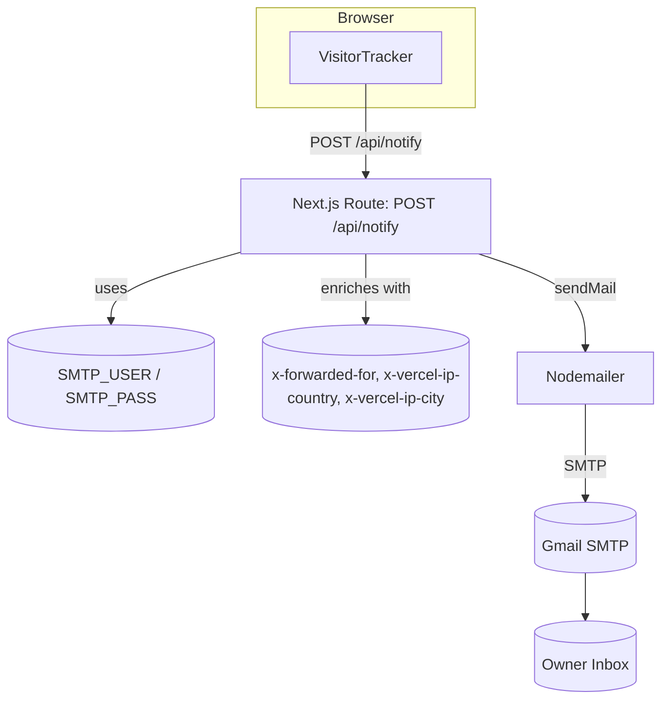
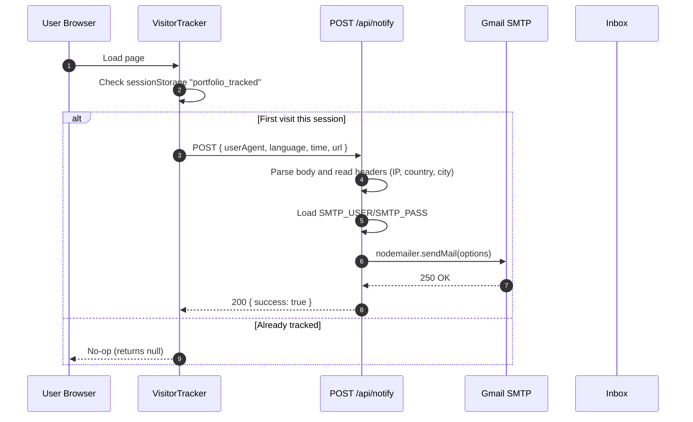
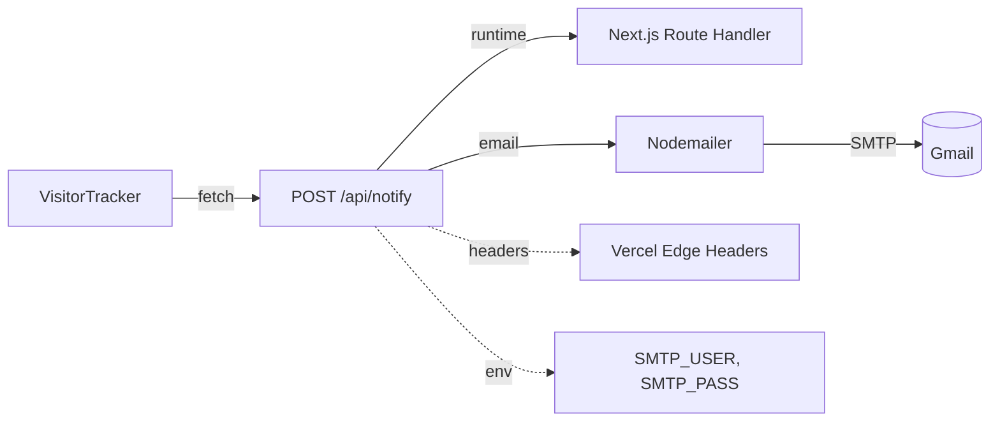

whoami_visitor_notify — Visitor notification and analytics pings

Introduction
The whoami_visitor_notify module provides a lightweight, privacy-conscious visitor notification feature for the portfolio. It ships a client-side tracker component that emits a one-time-per-session signal to a serverless API, which enriches the event with request metadata and dispatches an email notification via SMTP.

Core components
- components/visitor-tracker.tsx::VisitorTracker — Client component that posts visit metadata once per browser session.
- app/api/notify/route.ts::POST — Next.js Route Handler that formats an email and sends it using nodemailer.

How it fits in the system
- The VisitorTracker is intended to be rendered by the app shell or landing page, typically within whoami_home_integration’s Home page. See [whoami_home_integration.md].
- The serverless route follows the same App Router conventions used elsewhere (for example, whoami_serverless_api’s terminal endpoint). See [whoami_serverless_api.md].
- This module is independent of the terminal UI and command engine, but can coexist with them on the same page. See [whoami_terminal_ui.md] and [whoami_commands_engine.md] for their responsibilities.

High-level architecture

Component responsibilities and interactions
- VisitorTracker
  - Lifecycle: On mount, checks sessionStorage key portfolio_tracked to ensure one notification per session; if absent, sets it and posts a small JSON payload with userAgent, language, time, and url to /api/notify.
  - Failure behavior: Network errors are swallowed to avoid impacting UX.
  - Optional dev bypass: A commented guard can skip localhost to prevent spam during development.

- POST /api/notify
  - Parses request JSON and reads request headers for IP and geolocation hints (Vercel-provided headers when deployed).
  - Reads SMTP_USER and SMTP_PASS from environment and creates a nodemailer transporter (Gmail service).
  - Composes a styled HTML email summarizing the visit and sends it to the same SMTP_USER inbox.
  - Returns JSON { success: true } on success, or { success: false, error, code } on failures.

Request and response contract
- Endpoint: POST /api/notify
- Request body (JSON):
  - userAgent: string
  - language: string (e.g., en-US)
  - time: ISO string
  - url: string (full URL visited)
- Response (JSON):
  - success: boolean
  - message?: string
  - error?: string
  - code?: string

Data flow and enrichment

Dependency overview

Operational notes
- Runtime target: The route uses nodemailer, which requires the Node.js runtime. If deploying to platforms that default to Edge for route handlers, explicitly set:
  - export const runtime = 'nodejs'
- Credentials: Configure SMTP_USER and SMTP_PASS in environment. For Gmail, use an App Password with 2FA enabled. Less-secure-apps is deprecated.
- Headers: IP and geolocation fields rely on Vercel-provided headers; outside Vercel they may be Unknown.*
- Local development: To avoid inbox spam during dev, enable the localhost guard in VisitorTracker.
- Idempotence and spam reduction: sessionStorage key portfolio_tracked prevents multiple notifications per session per browser tab group. Consider stricter measures (see Hardening below).

Security, privacy, and hardening
- PII handling: Email content may include IP, city, and device info. Ensure this aligns with your privacy policy and regional laws (e.g., GDPR/CCPA). Consider hashing or omitting IPs.
- Rate limiting: Add per-IP or token bucket rate limits to /api/notify to prevent abuse (e.g., Upstash Ratelimit). See [whoami_serverless_api.md] for shared middleware patterns if available.
- Bot noise: Optionally filter known bots on the client (userAgent) and/or server. Add CAPTCHA or an HMAC signature if necessary.
- Transport security: Use HTTPS; do not log sensitive headers. Current server logs only on error.
- Secrets management: Store SMTP credentials in platform secrets, not in repo.

Observability and monitoring
- Logging: Currently minimal. Consider structured logs for deliveries and failures (without PII if required).
- Metrics: Track sendMail latency, error rates, and daily volume. Gmail has sending quotas; back off/retry accordingly.
- Alerting: If emails fail persistently, route to an alternative channel (e.g., Slack webhook) and raise an alert.

Failure modes and error handling
- Missing credentials: Returns 500 with { success: false, error: 'Misconfigured server config.' } and logs a console error.
- SMTP failures: Returns 500 with error and provider code when available.
- Network blocked/ad blockers: Client fetch failure is ignored by design; no user-visible errors.

Integrating VisitorTracker
- Recommended placement: Render once near the root of pages to ensure it runs on initial load. For example, in whoami_home_integration’s Home page:

  Example (TypeScript/React):
  import { VisitorTracker } from "../whoami_visitor_notify/components/visitor-tracker";

  export default function Home() {
    return (
      <>
        <VisitorTracker />
        {/* rest of the page */}
      </>
    );
  }

Configuration checklist
- Environment
  - SMTP_USER: Gmail address or SMTP username
  - SMTP_PASS: App password or SMTP password
- Deployment
  - Ensure Node.js runtime for the route handler
  - Verify Vercel headers are present (or handle Unknown fields)
- Client
  - Optionally enable localhost bypass during development

Extensibility ideas
- Multi-channel notifications: Add Slack, Discord, or webhook dispatch alongside email.
- Storage: Persist visit events (with consent) to a database for trends. Consider anonymization.
- Throttling: Extend session logic with server-side deduplication (e.g., cache keyed by IP+UA for N minutes).
- Templates: Externalize HTML email template and introduce theming or templating engine.

Reference to related modules
- UI shell and components used on the page: [whoami_terminal_ui.md]
- Command execution and terminal backend: [whoami_commands_engine.md]
- Other serverless endpoints and patterns: [whoami_serverless_api.md]
- Page composition and data sources: [whoami_home_integration.md]

Appendix: Source overview
- components/visitor-tracker.tsx::VisitorTracker
  - useEffect(() => { sessionStorage gating; fetch('/api/notify', JSON body); }, [])
- app/api/notify/route.ts::POST
  - Read body; read Vercel headers; validate SMTP env; createTransport({ service: 'gmail', auth: { user, pass } }); sendMail(options); return JSON
